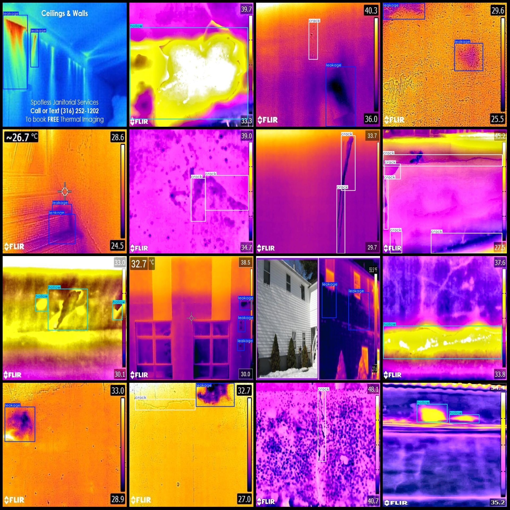
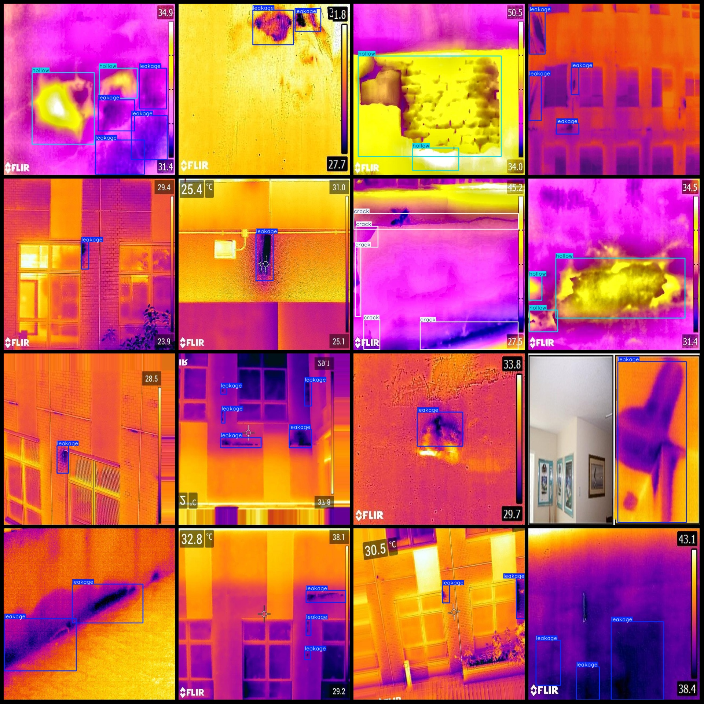

# Infrared Image Building Wall, Floor Defects, Holes, Cracks Detection Dataset VOC + YOLO Format 362 Categories

The dataset format is Pascal VOC format combined with YOLO format (excluding the segmentation path in txt files, only containing jpg images along with corresponding VOC format xml files and YOLO format txt files). The number of images (jpg file count): 362.
The number of annotations (xml file count): 362.
The number of annotations (txt file count): 362.
The number of annotation categories: 3.
Note that the order of categories in the YOLO format does not match this listing, but it corresponds to the labels folder's classes.txt file. ["crack", "hollow", "leakage"].
Each category has a certain number of bounding boxes:
- Crack (cracks) = 104.
- Hollow (voids) = 134.
- Leakage (leaks) = 524.
Total bounding box count: 762.
Image resolution: 640x640.
The dataset has an enhancement, with one third being the original image and the rest being created by pasting augmented images.
The annotation tool used is labelImg.
Annotation rules: draw bounding boxes for each category.
Important Note: No guarantee is made regarding the accuracy of models trained on this dataset or any weight files.
Preview of images:
Annotation example:
## Image

Here is a pay link on Stripe ( https://buy.stripe.com/3cs8yP7sY87d0vu9AB ). Please contact me lonlonago@foxmail.com after funding $89, and I will send you a complete data files , thank you!

